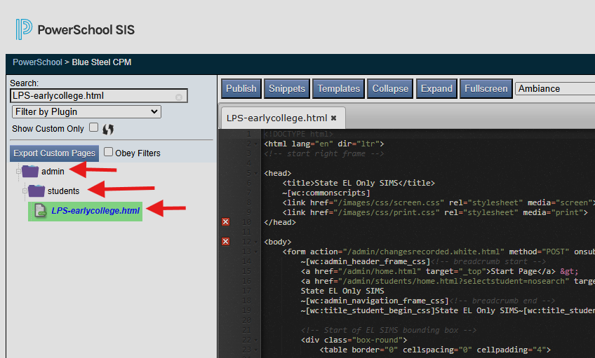
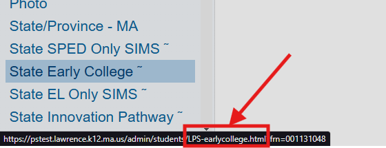

> 📌 This was my first bit of PowerSchool customization. I am documenting here the flow of how a plugin works for PowerSchool for future reference.

## This repository works by...

## Table of Contents

- [Folder Structure](#folder-structure)
- [What does each file do?](#what-does-each-file-do)
    - [WEB_ROOT/admin/students](#web_rootadminstudents)
    - [LPS-earlycollege.html](#lps-earlycollegehtml)
    - [more2.LPSearlycollege.leftnav.footer.txt](#more2lpsearlycollegeleftnavfootertxt)
    - [earlycollegePLugin.zip](#earlycollegepluginzip)
    - [plugin.xml](#pluginxml)
- [Closing Remarks](#closing-remarks)

### Folder Structure:
```
📂 WEB_ROOT/
├── 📂 admin/
│   ├── 📂 students/
│   │   ├── 📝LPS-earlycollege.html
│   │   ├── 📝more2.LPSearlycollege.leftnav.footer.txt
├── 🤐 earlycollegePLugin.zip
├── 📶 plugin.xml
├── ℹ️ README.md
```

### What does each file do?

📂📂📂**WEB_ROOT/admin/students:** 
<br/>
Specifies the directory within the PowerSchool web server where the plugin files should be installed, allowing PowerSchool to correctly reference and display them in the admin panel.
<br/>
(Picture of the directory structure in the admin panel)

<br/>
(Picture of the web address in the browser, passing in the student's FRN)


<hr/>

📝**LPS-earlycollege.html:** 
<br/>
This is the main file that is displayed when the plugin is clicked on in the admin panel. This is the main page of the plugin.


<hr/>

📝**more2.LPSearlycollege.leftnav.footer.txt:** 
<br/>
This script finds the link to the state page in the student information navigation menu by selecting the anchor tag with an href attribute that starts with 'state/stateMA.html?frn=', and then injects a new link to the early college page immediately after it.

(Actual txt file):
```txt
<script type="text/javascript">
$j(document).ready(function() {
$j( "ul#std_information > li > a[href^='state/stateMA.html?frn=']" ).parent().after($j('<li ><a href="LPS-earlycollege.html?frn=~(studentfrn)">STATE EARLY COLLEGE &tilde;</a></li>'));
});
</script>
```
(Demonstrative JavaScript code of the txt file):
```javascript
<script type="text/javascript">
$j(document).ready(function() {
    // Find the link to the state page
    $j("ul#std_information > li > a[href^='state/stateMA.html?frn=']") 
        // Get the student FRN
        .parent()
        // Find the next sibling
        .after(
            // Add a new link to the early college page
            $j('<li><a href="LPS-earlycollege.html?frn=~(studentfrn)">STATE EARLY COLLEGE &tilde;</a></li>')
        );
});
</script>
```

<hr/>

🤐**earlycollegePLugin.zip:** 
<br/>
This is the zip file that is uploaded to the admin panel to install the plugin.

<hr/>

📶**plugin.xml:** 
<br/>
This is the file that tells the admin panel where to put the plugin and what files to use. It also contains information about the plugin such as the name, version, and description.

```xml
<?xml version="1.0" encoding="UTF-8"?> 
<plugin xmlns="http://plugin.powerschool.pearson.com"
    xmlns:xsi="http://www.w3.org/2001/XMLSchema-instance"
    xsi:schemaLocation='http://plugin.powerschool.pearson.com plugin.xsd'
    name="LPS Early College"
    version="1.0"
    description="Early College Plugin for LPS">
    <publisher name="John Sandoval">
    <contact email="John.Sandoval@lawrence.k12.ma.us"/>
    </publisher>
</plugin>
```

## Closing Remarks

Thank you for taking the time to review the documentation for the LPS Early College plugin. This plugin aims to streamline the process of integrating early college information into the PowerSchool admin panel. If you have any questions or need further assistance, please feel free to reach out to me at John.Sandoval@lawrence.k12.ma.us.